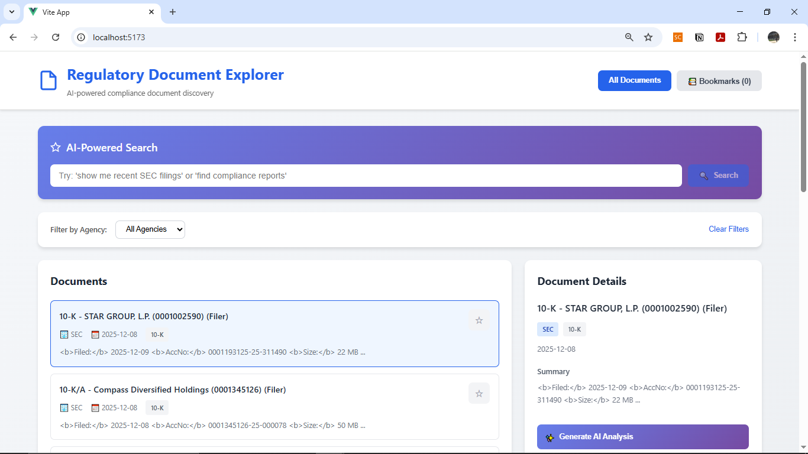
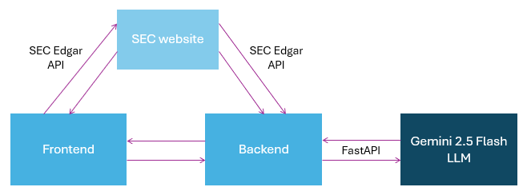

# 📄 AI Regulatory Document Explorer

## Introduction



This application is developed to streamline regulatory compliance research and document analysis. Users can revise the regulations without spending hours of going through the documents. AI engine in this app will do it for them in less than 5 minutes!

## App Overview and Architecture

There are 4 components involved in the development of this app: Frontend, Backend, LLM from Gemini and SEC Edgar API.

### Architecture Diagram



#### How It Works

- Both frontend and backend are connected to each other and to SEC website to get a public data.
- AI engine is integrated into this app by connecting LLM from Gemini 2.5 Flash to backend.
- Prompting is done in the backend, and FastAPI will fetch data from Gemini 2.5 Flash.
- Users will be able to see the list of documents, filter and search for them, bookmark them, and generate documents' summaries and keypoints.

<video controls src="Vite App - Google Chrome 2025-12-10 01-22-59.mp4" title="Title"></video>
_Click the video above to see how the app works._

### Component Roles

- **Frontend (Vue):** A responsive user interface built with Vue that handles user interaction. It fetches data from the backend and SEC API to display public data on the interface. It also contains bookmarking and filtering system.
- **Backend (FastAPI):** A Python-based API that serves regulatory data from a JSON file, provides the fetched data. It also connects with AI engine to analyse the document to produce keypoints and summaries.
- **AI Engine (Gemini):** Prompting to gain the keypoints and summaries is done through Google Gemini 2.5 Flash
- **Styling:** Custom CSS (no frameworks)
- **Data Source:** SEC Edgar API (public API) is used to gain access to the public regulatory documents

## Project Structure

```
dokumen-ai/
├── .venv/
├── backend/
│   ├── main.py              # FastAPI application
│   ├── requirements.txt     # Python dependencies
│   └── .env                 # Environment variables
│
├── frontend/
│   ├── src/
│   │   ├── App.vue         # Main Vue component
│   │   └── main.js         # Vue entry point
│   ├── index.html          # HTML template
│   ├── package.json        # Node dependencies
│   └── vite.config.js      # Vite configuration
│
└── README.md               # This file
```

## Running the App

Follow these steps to setup the project.

### Clone the Repository

```
git clone https://github.com/ainamardhia/dokumen-ai.git
cd dokumen-ai
```

### Frontend Setup (Vue)

Download Node.js

- If you don't have Node.js installed, download the LTS (Long-Term Support) version from the official [Node.js website](https://nodejs.org/en)

Verify Installation

- Open a new terminal and run the following commands to ensure Node.js and npm are installed correctly

```
node --version
npm --version
```

Navigate to frontend directory (make sure it is run on cmd, not powershell)

```
cd frontend
```

Install other dependencies

```
npm install
```

Run the frontend

```bash
npm run dev
```

- Frontend will be available at: http://localhost:5173

### Backend Setup (FastAPI)

Create virtual environment

```
py -m venv .venv
```

_Note that **.venv** is the name of the virtual environment_

Activate the virtual environment

```
# On Windows
.venv\scripts\activate

# On Mac/Linux
source .venv/bin/activate
```

Navigate to backend directory

```
cd backend
```

Install dependencies

```
pip install -r requirements.txt
```

Configure environment variables for Gemini

```
# Create .env file
cp .env.example .env

# Edit .env and add your Gemini API key
GEMINI_API_KEY=your-actual-api-key-here
```

_You can get get your Gemini API key here:_ https://aistudio.google.com/api-keys

Run the backend

```
py -m uvicorn main:app --reload
```

Backend will be available at:

- API Root: http://127.0.0.1:8000
- API Docs (Swagger UI) http://127.0.0.1:8000/docs

### Testing the AI Application

```
Query: "show me recent 10-K filings"
Expected: Documents filtered to 10-K type

Query: "find SEC compliance reports"
Expected: SEC documents returned

Query: "what are the latest FDA approvals"
Expected: FDA documents (if available)
```

## Challenges Encountered and Solutions

1. It is almost impossible to find public APIs in Malaysia, since most of them are privatised. Even if there is, like the one from DOSM, the data still cannot be fetched successfully

- _Solution_: Use public APIs like SEC Edgar API, FDA API, or FCC API

2. Token limitation from Gemini:

- _Solution_: I changed from Gemini 2.0 Flash to Gemini 2.5 Flash. If all else fails, just use other Google account ✌️

3. Cannot fetch data from public API:

- _Solution 1_: Frontend must be connected to backend
- _Solution 2_: Replace with mock API data

## Future Improvements of the Features

1. Add regulatory change tracking or alerts to the current documents

- This feature is important to keep up to date with new regulations, so that users will know exactly which regulation's sections are being updated without feeling overwhelmed

2. Add simple data visualization (charts for document trends)

- By adding this feature, users are able to keep track of their research on the regulations in charts, which streamlines user experience. Users can keep track of their documents in one go.
